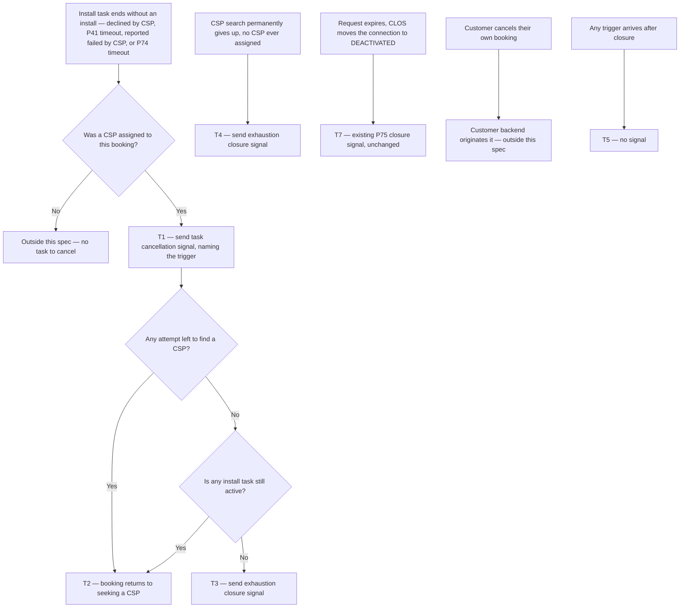

# Install Booking Status Signals — task cancellation and closure

| | | | |
|---|---|---|---|
| **Owner** — Ashish Raj (PM) | **Reviewer** — Engineering Manager | **Status** — Draft | **Sign-off** — Pending |
| **Version** — v0.2 · 27 Jul 2026 | **Consulted — Customer Backend** — Shail | **Consulted — Install Flow** — Ashish Raj | **Consulted — Allocation** — Ashish Raj |

Task cancellation and closure signals from the CSP world to the customer backend, so a customer waiting for an installation always knows whether it is still coming.

**Reading contract.** §3b is canon — if any statement disagrees with it, §3b wins, except dispatch order, which the §3a chart and its precedence rules own. Every fact has one home; every other mention is an ID reference. Failure behaviour is an envelope: the customer-facing outcome guaranteed when recovery runs out, independent of how recovery is attempted. This document states *what and why*; decomposition, schema, storage, retries, latency budgets and instrumentation belong to the implementer.

**Status.** Draft. Every review item is resolved. Awaiting reviewer sign-off.

---

## At a glance

Two new signals, one existing closure confirmed, and one existing behaviour protected by regression.

| | |
|---|---|
| **Problem** | When an install task is cancelled or the CSP world gives up, the customer backend is told nothing. It finds out only when its own fallback timer fires. |
| **Signal 1 — new** | **Task cancellation** — sent every time an assigned install task is cancelled inside the CSP world, by any of four named triggers, even when a replacement CSP is found in the same instant. |
| **Signal 2 — new** | **Closure, CSP world exhausted** — sent once per booking when every attempt to find a CSP is used up and no install task is active. |
| **Already live** | **Closure, connection deactivated** — the P75 signal sent when CLOS moves the connection to DEACTIVATED. Listed so the closure picture is complete; no work in this spec. |
| **Read this first** | "Cancellation" here always means an **install task** being cancelled by the CSP world — never a customer cancelling their booking. That is a different event travelling the other way, and it is out of scope (§8). |
| **Not in scope** | Technician reassignment already re-sends the technician's details on every change. No work needed — protected by AC-REG-2. |
| **Delivery** | Best effort, matching the existing signals on this channel. The customer backend's fallback timer therefore stays as the required backstop (R5). |
| **Owned elsewhere** | What the customer backend does on receiving a signal is entirely its own. This spec ends at the send. |

---

## 1. Objective & Definition of Success

**Objective.** A customer waiting for an installation always knows where their booking stands — whether the assigned CSP is still coming, and whether the booking can still be installed at all.

**Boundary.** This spec governs signals sent from the CSP world to the customer backend when an assigned **install task** is cancelled, and when the CSP world permanently stops trying to install a booking.

> **Task cancellation, not booking cancellation.** Every "cancellation" in this document means an **install task** being cancelled inside the CSP world — the assigned CSP drops the job, or a CSP-side timer takes it off them. A customer cancelling their own booking is a different event travelling the other way: the customer backend originates it and tells us. It needs no signal back and is out of scope (§8).

It leaves unchanged:

- The six install signals sent today — slot proposal, slot assignment, CSP arrived, ID verified, wiring done, account creation (AC-REG-1).
- Technician reassignment. A CSP who changes the assigned technician already re-sends the technician's name and mobile on every change. No work here (AC-REG-2).
- The P75 closure signal sent today when CLOS moves the connection to DEACTIVATED (AC-REG-3, T7).
- Customer-initiated booking cancellation, in both directions (AC-REG-4).
- Every other CSP-world behaviour on the cancellation and closure paths — when a task is cancelled, when the CSP world stops trying, how many attempts a booking gets (R6, G4).
- What the customer backend does on receiving any signal. This spec ends at the send; everything past it belongs to the customer team.

Out of scope: a device returned to the warehouse after installation; the defect where a failed technician lookup sends an empty name and mobile.

### The signals

Three in total on these paths. Two are new; one already runs today and is listed so the closure picture is complete.

| Signal | Sent when | Carries | How often | Build |
|---|---|---|---|---|
| **Task cancellation** | An assigned install task is cancelled inside the CSP world, by one of four triggers — **declined by CSP** · **P41 timeout** (the CSP never accepted) · **installation reported failed by CSP** · **P74 timeout** (the install window elapsed) — T1 | Which of the four triggers fired · whether a CSP acted or a CSP-side timer did · which CSP the task was taken from · **the reason the CSP gave**, on the two triggers where a CSP acts · whether further attempts will be made (R3a, R3b) | Every time, even when a replacement CSP is found in the same instant (G1). Repeats across successive CSPs are expected and correct | **New** |
| **Closure — CSP world exhausted** | Every attempt to find a CSP is used up **and** no install task is active. The CSP world permanently stops trying (T3, T4) | The reason the CSP world stopped — attempts used up after CSPs tried and failed, or no CSP findable at all (R2a) | At most once per booking, keyed on the booking's customer id (R2b) | **New** |
| **Closure — connection deactivated (P75)** | CLOS moves the connection to DEACTIVATED on request expiry (T7) | Unchanged from today | Once per booking | **Live today** — no work in this spec (AC-REG-3) |

### Guardrails — promises that hold on every path

| ID | Guardrail | One line | Anchors |
|---|---|---|---|
| G1 | **Every task cancellation speaks** | Every task cancellation on a live booking sends a signal, whether or not a replacement CSP is found. Once a booking is closed, nothing further is sent (P2). A customer cancelling their own booking is not a task cancellation and sends nothing (R1 MUST NOT (b)). | R1a · AC-CAN-1 · AC-CAN-4 · MQ-1 |
| G2 | **No silent giving up** | Every way the CSP world can permanently stop trying reaches the customer backend — the new exhaustion closure, or the P75 deactivation closure that already runs. Whichever happens first. A booking already closed sends nothing further (P2, R2b). | R4 · AC-TRM-3 · MQ-2 |
| G3 | **Always attributed** | Every signal says who caused it and why, without the reader having to infer it. For a task cancellation that means naming which of the four triggers fired, and passing on the reason the CSP gave whenever a CSP was the one who acted. | R3a · R3b · AC-GRD-1 · MQ-5 |
| G4 | **Nothing existing breaks** | This change adds signals and nothing else. Every CSP-world behaviour around task cancellation and closure works exactly as it does today — same triggers, same attempt counts, same reallocation, same timing, same P75 closure. | R6 · AC-REG-1 · AC-REG-2 · AC-REG-3 · AC-REG-4 · AC-GRD-3 · MQ-6 |

### Success metrics

| ID | Metric | Baseline | Target | Source |
|---|---|---|---|---|
| M1 | Task cancellations and exhaustion closures that sent a signal | n/a — new capability | ≥ 99% | MQ-1, MQ-2 |
| M2 | Customer calls asking for install status | none today — no call-reason data exists | Reduction | MQ-4 |

**Invariant (not a metric):** R2b bookings receiving more than one closure signal = 0, zero tolerance. Monitored via MQ-3, not trended.

> **Note on M2.** Calls only fall if the customer team turns these signals into visible status in their app — work outside this spec. M1 is the measure this spec alone controls; M2 is the joint outcome.

---

## 2. User Stories & Rules

| ID | Story | MUST | MUST NOT |
|---|---|---|---|
| R1 | As a customer whose assigned CSP is no longer coming, I want that fact sent to the customer backend, so my booking status stops showing someone who will not arrive. | **(a)** Send a task cancellation signal every time an assigned install task is cancelled, by any of the four triggers: declined by CSP, P41 timeout, installation reported failed by CSP, P74 timeout. **(b)** Send it immediately, once the cancellation is settled. | **(a)** Hold back or merge the signal because a replacement CSP was found in the same moment. **(b)** Send a task cancellation signal when the customer cancelled their own booking — that event travels the other way. |
| R2 | As a customer whose booking can no longer be installed, I want the customer backend told for certain, so it is never left guessing whether the CSP world is still working on my booking. | **(a)** Send an exhaustion closure signal immediately when every attempt to find a CSP is used up and no install task is active, carrying the reason it stopped. **(b)** Send at most one closure signal per booking, keyed on the booking's customer id. **(c)** Leave the existing P75 deactivation closure exactly as it runs today. | **(a)** Leave the customer backend to work this out from its fallback timer. **(b)** Send an exhaustion closure while any attempt remains, or while any install task is still active. |
| R3 | As the customer backend, I need to tell these cases apart without guessing, so I can act differently on each. | **(a)** Carry on every signal: which trigger fired; whether a CSP acted or a CSP-side timer did; which CSP the task was taken from; and whether further attempts will be made. **(b)** On the two triggers where a CSP acts — declining, and reporting the installation failed — also carry the reason that CSP gave, as they gave it. | **(a)** Require the reader to infer any of these from timing, ordering, or the absence of a later signal. **(b)** Invent, translate or summarise the CSP's reason, or attach one to a P41 or P74 timeout, where no CSP gave a reason at all. |
| R4 | As a customer, I want the same answer whichever way the CSP world ran out of options, so no dead booking stays silent. | Cover **every** path on which the CSP world permanently stops trying — CSPs tried and failed, no CSP findable at all, and connection deactivation (P75). | Cover only the common path and leave the others silent. |
| R5 | As the business, I want a backstop, because these signals can be lost in transit. | Keep the customer backend's existing 14-day fallback timer running. | Treat the timer as the primary path, or remove it once these signals ship. |
| R6 | As the install pod, I want this change to add observation only, so shipping it cannot make installations worse. | Leave every existing CSP-world behaviour on the cancellation and closure paths exactly as it is — the four triggers, the number of attempts a booking gets, reallocation, the P75 closure, and the timing of each. | **(a)** Change when a task is cancelled or when the CSP world stops trying. **(b)** Let a failure to send a signal alter, delay or block the install flow. |

---

## 3. System Behaviour

### 3a. System flow chart

**Precedence P1.** When a task cancellation and an exhaustion closure fall due at the same moment, the task cancellation is sent first, then the closure (AC-RACE-1).

**Precedence P2.** A closure of either kind always wins over a later task cancellation. Once a booking is closed, no further signal of any kind is sent (AC-RACE-2).

### 3b. State transition table — canon

Lifecycle of an **install journey** (created when a booking becomes a request for installation; ends when the booking is installed or the CSP world stops trying). The CSP's own task lifecycle, the customer cancelling their own booking, and everything the customer backend does on receiving a signal are out of scope.

| ID | From | Action / Trigger | Rule / Check | To | Side-effects |
|---|---|---|---|---|---|
| T1 | CSP assigned | One of four triggers: declined by CSP; installation reported failed by CSP; P41 timeout; P74 timeout | The booking was not cancelled by the customer | Task cancellation pending | Task cancellation signal sent immediately, naming which trigger fired, whether a CSP or a timer acted, the outgoing CSP, and whether further attempts will be made (R1a, R1b, R3a, G1). On the two CSP-acted triggers it also carries the reason that CSP gave; on the two timeouts it carries none, because none was given (R3b, G3). The trigger itself behaves exactly as it does today (R6, G4). |
| T2 | Task cancellation pending | — | An attempt remains, or an install task is still active | Seeking a CSP | No further signal. The booking re-enters CSP search unchanged (R2b, R6). |
| T3 | Task cancellation pending | — | No attempt remains **and** no install task is active | Closed — cannot be installed | Exhaustion closure signal sent immediately, after the T1 task cancellation, carrying the reason the CSP world stopped (R2a, R4, P1, G2). |
| T4 | Seeking a CSP | CSP search permanently gives up | No CSP was ever assigned and no install task is active | Closed — cannot be installed | Exhaustion closure signal sent immediately (R2a, R4, G2). No task cancellation signal — no CSP was assigned, so no task existed to cancel. |
| T5 | Closed — cannot be installed | Any further task cancellation or closure trigger | — | Closed — cannot be installed | No signal. At most one closure per booking (R2b, P2). |
| T6 | Any | Signal send fails | — | Unchanged | Delivery is best effort. The install flow is never altered, delayed or blocked by a send failure (R6b). Until the customer backend's fallback timer fires the booking looks alive to it — that timer is the sole backstop (R5). Recovery before then is the implementer's. |
| T7 | Seeking a CSP | Request expires; CLOS moves the connection to DEACTIVATED (P75) | — | Closed — cannot be installed | The existing P75 closure signal is sent, exactly as it runs today. This spec adds nothing here and changes nothing (R2c, R4, AC-REG-3, G4). |

**Note on T1.** The four triggers are grouped because they produce the same customer outcome: the assigned CSP is not coming. They differ only in the attribution the signal carries (R3, G3).

**Note on T1's check.** A booking the customer cancelled ends through the customer backend's own path, which already knows the outcome. No task cancellation signal is sent back to it (R1 MUST NOT (b), AC-REG-4).

**Note on T3 and T4.** Both send the same exhaustion closure. They differ only in whether a CSP was ever assigned — T3 follows CSPs who tried and failed, T4 follows a search that never found anyone. Two conditions must both hold: no attempt remains, and no install task is active. A live task anywhere keeps the booking open (R2 MUST NOT (b)).

**Entry and exit outside this table.** A booking enters at **Seeking a CSP** when it becomes a request for installation, and moves to **CSP assigned** when a CSP is committed to it. Both are governed upstream and send no signal here. A booking that installs successfully leaves the journey through the existing account-creation signal (§1 Boundary) — no row here, and no cancellation or closure signal (AC-REG-1).

---

## 4. Screen Requirements

**No screens.** This spec defines signals between the CSP world and the customer backend. Nothing the customer sees is built here — the customer team owns every screen driven by these signals, specified separately. No Wiom-side CSP or operations screen changes.

---

## 5. Configurability

**No configurable parameters.** This spec introduces no tunable numbers. Both new signals go out immediately; any latency budget is engineering's to set and change, not a product parameter. The one-closure-per-booking limit is an invariant, not a setting (R2b). P41, P74 and P75 are existing CSP-world parameters this spec observes but never changes (R6, G4). The customer backend's 14-day fallback timer is named in R5 and §8 as an external fact — the customer team owns it.

---

## 6. Measurement

| ID | The system must be able to answer… | Feeds |
|---|---|---|
| MQ-1 | Of all install tasks cancelled by the four triggers, how many sent a task cancellation signal — split by trigger. | M1 · G1 · G3 · R1a |
| MQ-2 | Of all bookings the CSP world stopped trying on, how many reached the customer backend — by exhaustion closure or by the existing P75 closure — and how many were found only by the customer backend's fallback timer. | M1 · G2 · R4 · R5 |
| MQ-3 | Whether any booking received more than one closure signal, counting both kinds. | R2b invariant |
| MQ-4 | How many customer calls ask for installation status. | M2 |
| MQ-5 | For each signal sent, whether the trigger, the actor, the outgoing CSP and further-attempts were all present — and, on CSP-acted cancellations, whether the CSP's reason came through. | G3 · R3a · R3b |
| MQ-7 | What reasons CSPs give when they decline or report an installation failed, and how those reasons are distributed. | G3 · R3b |
| MQ-6 | Whether the rate, timing and attempt counts of task cancellations, reallocations and closures changed after this shipped. | G4 · R6 |

---

## 7. Acceptance Criteria

### CAN — Task cancellation signal (T1, T2)

| AC | Given / When / Then | Verifies | Status |
|---|---|---|---|
| AC-CAN-1 | **Given** booking 884213 with CSP Sunrise Networks assigned and a slot confirmed for 3 Aug, **When** Sunrise declines the task at 10:00:00 giving the reason "no technician available this week", **Then** a task cancellation signal for booking 884213 goes out immediately, naming the trigger as declined by CSP, the actor as the CSP, Sunrise as the outgoing CSP, and that reason exactly as Sunrise gave it. | R1a · R1b · R3a · R3b · T1 · G1 · G3 | Settled |
| AC-CAN-2 | **Given** the same booking, **When** Sunrise instead reports the installation failed at 10:00:00 giving the reason "customer premises locked", **Then** the task cancellation signal names the trigger as installation reported failed by CSP — not a decline — and carries that reason. | R3a · R3b · T1 · G3 | Settled |
| AC-CAN-3 | **Given** booking 884213 assigned to Sunrise, who never accepts, **When** the P41 acceptance window expires, **Then** the task cancellation signal names the trigger as P41 timeout and the actor as a CSP-side timer, not the CSP — and carries **no** CSP reason, because no CSP gave one. | R3a · R3 MUST NOT (b) · T1 · G3 | Settled |
| AC-CAN-4 | **Given** booking 884213 with Sunrise assigned, **When** Sunrise declines at 10:00:00.000 and CSP Bluewave is assigned at 10:00:00.180, **Then** the task cancellation signal was still sent — it is not suppressed by the replacement being found in the same moment. | R1a · R1 MUST NOT (a) · T1 · G1 | Settled |
| AC-CAN-5 | **Given** booking 884213 where an attempt remains after the task cancellation, **When** the signal is sent, **Then** it states that further attempts will be made, and no closure signal is sent. | R3a · T2 · R2b | Settled |
| AC-CAN-6 | **Given** booking 884213 assigned to Sunrise, who has accepted but not installed, **When** the P74 install window elapses, **Then** the task cancellation signal names the trigger as P74 timeout, the actor as a CSP-side timer, and carries no CSP reason. | R3a · R3 MUST NOT (b) · T1 · G3 | Settled |
| AC-CAN-7 | **Given** booking 884213, **When** Sunrise declines giving a reason of 300 characters that includes a line break, **Then** the signal carries that reason unaltered — not truncated, summarised or rewritten. | R3b · R3 MUST NOT (b) · G3 | Settled |

### TRM — Exhaustion closure signal (T3, T4)

| AC | Given / When / Then | Verifies | Status |
|---|---|---|---|
| AC-TRM-1 | **Given** booking 884213 where three CSPs have already failed and Bluewave is the fourth, **When** Bluewave's P74 window elapses with no attempt remaining and no install task active, **Then** a task cancellation signal is sent and then an exhaustion closure signal, both immediately, and the closure states that CSPs tried and failed. | R2a · R4 · T3 · P1 · G2 | Settled |
| AC-TRM-2 | **Given** booking 990117 that never had a CSP assigned, **When** the CSP search permanently gives up and no install task is active, **Then** an exhaustion closure signal is sent immediately stating no CSP could be found — and **no** task cancellation signal is sent. | R2a · R4 · T4 · G2 | Settled |
| AC-TRM-3 | **Given** every booking that reached a stopping condition during August — CSPs tried and failed, no CSP findable, or P75 deactivation — **When** MQ-2 is run for that month, **Then** each one reached the customer backend by one closure or the other, and the count found only by the fallback timer is zero. | R4 · T3 · T4 · T7 · G2 · MQ-2 | Settled |
| AC-TRM-4 | **Given** booking 884213 with two attempts still available, **When** the current CSP declines, **Then** no closure signal is sent. | R2 MUST NOT (b) · T2 | Settled |
| AC-TRM-5 | **Given** booking 884213 with no attempts remaining but an install task still active with CSP Citylink, **When** the exhaustion condition is evaluated, **Then** no closure signal is sent — a live task keeps the booking open. | R2 MUST NOT (b) · T2 · T3 check | Settled |

### WF — Workflows (T1 → T2 → T1 → T3)

| AC | Given / When / Then | Verifies | Status |
|---|---|---|---|
| AC-WF-1 | **Given** booking 884213 created 20 Jul, **When** four CSPs in turn are assigned and each task is cancelled — Sunrise declines, Bluewave hits P41 timeout, Citylink hits P74 timeout, Deepnet reports failure using the last attempt — **Then** the customer backend received four task cancellation signals naming their four triggers, and exactly one exhaustion closure, in that order, and never had to wait for the fallback timer. | T1 · T2 · T3 · G1 · G2 · G3 · R2b · R2 MUST NOT (a) · R5 MUST NOT | Settled |
| AC-WF-2 | **Given** booking 990117 created 20 Jul in a zone with no eligible CSPs, **When** the CSP search gives up without ever assigning anyone, **Then** the customer backend received zero task cancellation signals and exactly one exhaustion closure. | T4 · G2 · G1 | Settled |

### FAIL — Failure window (T6)

| AC | Given / When / Then | Verifies | Status |
|---|---|---|---|
| AC-FAIL-1 | **Given** booking 884213 reaching exhaustion at 10:00:00 on 1 Aug, **When** the closure signal fails to send and is lost, **Then** no retry occurs, the install flow is unaffected, and the booking is still resolved by the customer backend's 14-day fallback timer by 15 Aug. | T6 · R5 · R6b | Settled |
| AC-FAIL-2 | **Given** a lost exhaustion closure for booking 884213, **When** MQ-2 is run for August, **Then** that booking is reported as found by the fallback, not as signalled. | MQ-2 · M1 | Settled |

### REG — Regression (§1 Boundary)

| AC | Given / When / Then | Verifies | Status |
|---|---|---|---|
| AC-REG-1 | **Given** booking 884213 progressing normally to an installed connection, **When** the journey completes, **Then** all six existing signals — slot proposal, slot assignment, CSP arrived, ID verified, wiring done, account creation — were sent exactly as before, and no cancellation or closure signal was sent. | §1 Boundary · G4 | Settled |
| AC-REG-2 | **Given** booking 884213 with technician Ramesh assigned, **When** the CSP changes the technician to Kavita, **Then** the customer backend receives the slot-assignment signal carrying Kavita's name and mobile, exactly as it does today — unchanged by this spec. | §1 Boundary · G4 | Settled |
| AC-REG-3 | **Given** booking 990117 whose request expires, **When** CLOS moves the connection to DEACTIVATED, **Then** the existing P75 closure signal is sent exactly as it is today, and this spec adds no second closure for the same booking. | §1 Boundary · R2c · T7 · R2b · G4 | Settled |
| AC-REG-4 | **Given** booking 884213 with Sunrise assigned, **When** the customer cancels their own booking through the customer app, **Then** the booking ends through the existing customer-cancellation path and **no** task cancellation signal is sent back to the customer backend. | R1 MUST NOT (b) · T1 check · §1 Boundary · G4 | Settled |
| AC-REG-5 | **Given** booking 884213 whose first CSP declines, **When** the CSP world reallocates, **Then** the booking gets the same number of further attempts, in the same order, over the same timings as it would have before this spec shipped — the signal is the only difference. | R6 · R6 MUST NOT (a) · G4 · MQ-6 | Settled |

### RACE — Precedence (P1, P2)

| AC | Given / When / Then | Verifies | Status |
|---|---|---|---|
| AC-RACE-1 | **Given** booking 884213 on its final attempt, **When** the P74 window elapses — cancelling the task and exhausting the last attempt in the same moment — **Then** the task cancellation signal is sent first and the exhaustion closure second. | P1 · T3 | Settled |
| AC-RACE-2 | **Given** booking 884213 already closed at 10:00:00, **When** a further task cancellation trigger arrives at 10:00:01, **Then** no signal of any kind is sent. | P2 · T5 · R2b | Settled |

### DUP — Duplicate triggers

| AC | Given / When / Then | Verifies | Status |
|---|---|---|---|
| AC-DUP-1 | **Given** booking 884213 that has received its exhaustion closure, **When** a P75 deactivation later occurs for the same booking, **Then** no second closure signal is sent — the count of closure signals for booking 884213 remains 1. | R2b · T5 · MQ-3 | Settled |
| AC-DUP-2 | **Given** booking 884213 with Sunrise assigned, **When** Sunrise's task is cancelled, then Bluewave is assigned and also cancelled, **Then** two task cancellation signals were sent — repeats are expected and correct. | R1a · T1 · G1 | Settled |
| AC-DUP-3 | **Given** booking 884213 with Sunrise assigned, **When** the same decline is submitted twice at 10:00:00 and 10:00:02, **Then** exactly one task cancellation signal is sent for that decline — a repeated trigger on the same already-cancelled task adds nothing. | R1a · T1 · G1 | Settled |

### BV — Boundary values (attempt limit)

| AC | Given / When / Then | Verifies | Status |
|---|---|---|---|
| AC-BV-1 | **Given** booking 884213 with exactly one attempt remaining, **When** the current CSP's task is cancelled, **Then** a task cancellation signal is sent stating further attempts will be made, and no closure signal is sent. | T2 · R3a · R2b | Settled |
| AC-BV-2 | **Given** booking 884213 with no attempts remaining and no active task, **When** the current CSP's task is cancelled, **Then** both a task cancellation and an exhaustion closure are sent. | T3 · P1 · G2 | Settled |

### GRD — Guardrails

| AC | Given / When / Then | Verifies | Status |
|---|---|---|---|
| AC-GRD-1 | **Given** any signal sent in August, **When** MQ-5 is run, **Then** every one carried its trigger, its actor, the outgoing CSP and further-attempts — none blank, none inferred — and every CSP-acted cancellation also carried the CSP's own reason. | G3 · R3a · R3b · MQ-5 | Settled |
| AC-GRD-2 | **Given** every install task cancelled in August by any of the four triggers, **When** MQ-1 is run, **Then** each one has a matching task cancellation signal, and the split by trigger accounts for all of them. | G1 · G3 · MQ-1 | Settled |
| AC-GRD-3 | **Given** the month before this shipped and the month after, **When** MQ-6 compares them, **Then** task cancellation rate, reallocation rate, attempts per booking, P75 closure rate and exhaustion rate are unchanged — the only difference is that the two new signals now go out. | G4 · R6 · MQ-6 | Settled |

---

## 8. Glossary

| Term | Meaning | Owner (domain) |
|---|---|---|
| Task cancellation | **Canonical definition:** an assigned install task ending inside the CSP world without an installation, by one of exactly four triggers — declined by CSP, P41 timeout, installation reported failed by CSP, P74 timeout. Always the CSP world's own doing. Distinct from a customer cancelling their booking, which this document never calls a cancellation. All other mentions cite this definition. | Install Flow |
| Customer booking cancellation | The customer choosing to cancel their booking. The customer backend originates it and tells the CSP world, so it needs no signal back. Out of scope in both directions (R1 MUST NOT (b), AC-REG-4). Named here only so it is never confused with a task cancellation. | Customer Backend |
| CSP world | **Canonical definition:** every Wiom system that finds a CSP for a booking, assigns the work, and runs the installation. Everything on the Wiom side of the signal. | Install Flow |
| Customer backend | The system that owns the customer's booking record and the customer app. It receives these signals. What it does on receiving them is entirely its own and out of scope throughout this document. | Customer Backend |
| Install journey | **Canonical definition:** one booking's path from "needs installing" to either installed or abandoned, across however many CSPs are tried. The entity whose lifecycle §3b governs. Not the same as one CSP's task — a journey can contain several. | Install Flow |
| Task cancellation signal | A message saying the CSP currently assigned to this booking is no longer coming. Names which of the four triggers fired, who acted, which CSP, and whether the search continues. Sent on every task cancellation (G1). | — |
| Exhaustion closure signal | A message saying no CSP will install this booking because every attempt is used up and nothing is active. New in this spec. Sent at most once per booking (R2b). | — |
| P75 closure signal | The closure already sent today when CLOS moves the connection to DEACTIVATED on request expiry. Runs unchanged; listed so the closure picture is complete (T7, AC-REG-3). | Install Flow |
| CSP-entered reason | What the CSP themselves said when they declined a task or reported an installation failed — passed through as given, never reworded. Exists only on those two triggers; a P41 or P74 timeout has none, because no one was asked (R3b). | Install Flow |
| Assigned install task | A booking that has a named CSP committed to installing it. Cancelling one is what triggers a task cancellation signal. | Install Flow |
| Attempts used up | The CSP world will not look again. Two separate limits can run out — the number of failed installs allowed, and the number of times the search may come back empty. Either running out means no attempt remains (R4). | Install Flow |
| No install task active | No CSP anywhere is currently holding a live task for this booking. Both this and "attempts used up" must hold before an exhaustion closure is sent (R2 MUST NOT (b)). | Install Flow |
| CSP search gives up | The point at which the CSP world stops looking for a CSP and will not resume on its own. | Allocation |
| Fallback timer | The customer backend's own 14-day clock, which closes a booking it has heard nothing about. Owned by the customer team, not this spec. Kept as the backstop for a lost signal (R5). | Customer Backend |
| Seeking a CSP | **State (§3b).** The booking needs installing and no CSP is currently committed to it. Its starting state, and where it returns after a task cancellation with attempts left. | Install Flow |
| CSP assigned | **State (§3b).** A named CSP is committed to installing this booking. The state a task cancellation signal is sent from. | Install Flow |
| Task cancellation pending | **State (§3b).** The moment between an assigned task being cancelled and knowing whether the CSP world will try again. Exists only to make the two outcomes — T2 and T3 — separate rows. | Install Flow |
| Closed — cannot be installed | **State (§3b).** No CSP will install this booking. Terminal: no further signal of any kind (P2, R2b). Reached by exhaustion (T3, T4) or by P75 deactivation (T7). | Install Flow |
| Named CSP-side triggers | The four T1 triggers map to: CSP decline; report-installation-failed; the P41 acceptance window; the P74 install window. The two exhaustion limits are P78 (install retries) and P50 (routing attempts). P75 is the request-expiry deactivation behind T7. | Install Flow |

---

## 9. Notes for System Capabilities

What the platform must be able to do for this feature to exist. Whether these are one system or several, and how they interact, is the implementer's design.

| Capability | Needed by |
|---|---|
| Detect that an assigned install task has ended without an installation, from any of the four triggers, and emit a signal immediately naming which one fired. | T1 · R1 · G1 · G3 |
| Tell a CSP-side task cancellation apart from a customer cancelling their own booking, and signal only the former. | T1 check · R1 MUST NOT (b) · AC-REG-4 |
| State, at the moment of a task cancellation, whether the CSP world will try again. | T2 · T3 · R3a · G3 |
| Detect that every attempt to find a CSP is used up **and** no install task is active — across both exhaustion limits — and emit a closure immediately. | T3 · T4 · R2a · R4 · G2 |
| Emit a closure at most once per booking, keyed on the booking's customer id, counting the existing P75 closure against the same limit. | T5 · T7 · R2b · AC-DUP-1 |
| Carry the trigger, the actor, the outgoing CSP and further-attempts on every signal. | R3a · G3 · MQ-5 |
| Capture the reason a CSP gives when declining or reporting an installation failed, and pass it through unaltered — while sending none on a timeout. | R3b · G3 · MQ-5 · MQ-7 |
| Emit all of the above without altering, delaying or blocking any existing cancellation, reallocation, P75 closure or timing behaviour — including when a send fails. | R6 · G4 · T6 · T7 |
| Count task cancellations by trigger, closures of both kinds, and fallback-resolved bookings; detect a duplicate closure; and compare rates and attempt counts before and after launch. | MQ-1 · MQ-2 · MQ-3 · MQ-5 · MQ-6 |

---

## Overrides

| Rule | What was done instead | Rationale | Approved by |
|---|---|---|---|
| §4 requires one block per screen | §4 states "no screens" with reasoning | The feature is a backend-to-backend signal contract with no Wiom-side UI | Ashish Raj, 27 Jul 2026 |
| §5 requires every changeable number as a C-id | §5 states there are none | This spec has no tunables. Latency is engineering's to set, the one-closure limit is an invariant (R2b), P41/P74/P75 are existing parameters this spec only observes, and the 14-day fallback belongs to the customer backend | Ashish Raj, 27 Jul 2026 |
| L11 — every §3b row reachable in the §3a chart | T6 (signal send fails) has no chart node | T6 is a failure envelope, not a dispatch route. Putting it in the chart would imply it is a routing decision. Template v3's own worked example follows the same pattern | Ashish Raj, 27 Jul 2026 |
| AC group prefix should match its subject | The task cancellation group keeps the prefix `CAN` | Renaming would change every AC id in the group and every citation of them across §1, §3b, §7 and §9 — churn with no reader benefit. The group heading carries the full name | Ashish Raj, 27 Jul 2026 |
| Template v3 says delete every 📋 guidance block | The **Reading contract** is kept, restated as document content above §1 | It states load-bearing rules — §3b is canon, one home per fact, failure as an envelope. Cross-pod readers who do not know Template v3 cannot interpret the document without them | Ashish Raj, 27 Jul 2026 |
| Template v3 has no summary section | An **At a glance** block sits between the header and §1 | Readers outside the install pod need the shape of the change before the rules. It restates §1/§2 only and adds no obligation, so §1 remains the objective's one home | Ashish Raj, 27 Jul 2026 |
| Template v3 §1 holds Objective, Boundary, Guardrails and Metrics only | A **signals** table sits in §1 after the Boundary | The deliverable of this spec is the signals. Without one place naming them, when each fires, what each carries and which already exist, a reader has to assemble it from §1, §2, §3b and §8 | Ashish Raj, 27 Jul 2026 |
| This spec states what and why, not mechanism | P41, P74, P75, P78 and P50 are named in §1, §2, §3b, §5, §7 and §8 | The four cancellation triggers and the P75 closure are the PM's own definition of scope. Naming them removes the ambiguity a paraphrase would leave, and parameter names stay stable where their values do not | Ashish Raj, 27 Jul 2026 |
