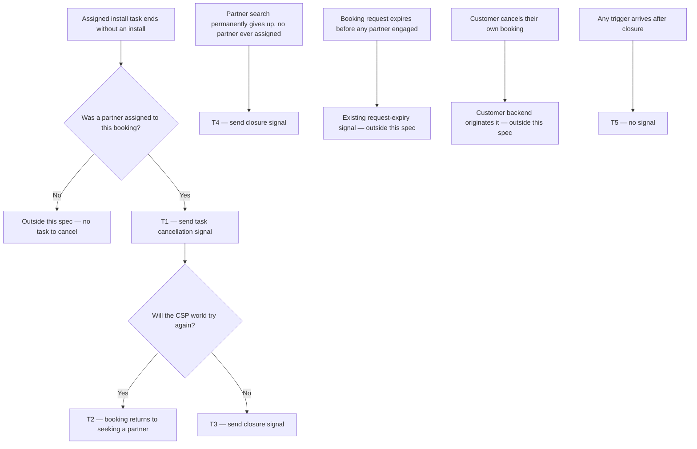

# Install Booking Status Signals — task cancellation and closure

| | | | |
|---|---|---|---|
| **Owner** — Ashish Raj (PM) | **Reviewer** — TBD ⚠️ *AI GENERATED — review* | **Status** — Draft | **Sign-off** — Pending |
| **Version** — v0.2 · 27 Jul 2026 | **Consulted — Customer Backend** — TBD ⚠️ *AI GENERATED — review* | **Consulted — Install Flow** — TBD ⚠️ *AI GENERATED — review* | **Consulted — Allocation** — TBD ⚠️ *AI GENERATED — review* |

---

## 1. Objective & Definition of Success

**Objective.** A customer waiting for an installation always knows where their booking stands — whether the assigned partner is still coming, and whether the booking can still be installed at all.

**Boundary.** This spec governs two signals sent from the CSP world to the customer backend: one when an assigned **install task** is cancelled, and one when the CSP world permanently stops trying to install a booking.

> **Task cancellation, not booking cancellation.** Every "cancellation" in this document means an **install task** being cancelled inside the CSP world — the assigned partner drops the job, or a CSP-side timer takes it off them. A customer cancelling their own booking is a different event travelling the other way: the customer backend originates it and tells us. It needs no signal back and is out of scope (§8).

It leaves unchanged:

- The six install signals sent today — slot proposal, slot assignment, partner arrived, ID verified, wiring done, account creation (AC-REG-1).
- Technician reassignment. A partner who changes the assigned technician already re-sends the technician's name and mobile on every change. No work here (AC-REG-2).
- The request-expiry signal sent today when a booking dies before any partner is assigned (AC-REG-3).
- Customer-initiated booking cancellation, in both directions (AC-REG-4).
- What the customer backend does with any signal — refunds, messages, app screens. That work is owned by the customer team and specified separately.

Out of scope: a device returned to the warehouse after installation; the defect where a failed technician lookup sends an empty name and mobile.

At most one closure signal per booking (C-03).

### Guardrails — promises that hold on every path

| ID | Guardrail | One line | Anchors |
|---|---|---|---|
| G1 | **Every task cancellation speaks** | Every task cancellation on a live booking sends a signal, whether or not a replacement partner is found. Once a booking is closed, nothing further is sent (P2). A customer cancelling their own booking is not a task cancellation and sends nothing (R1 MUST NOT (b)). | R1a · AC-CAN-1 · AC-CAN-4 · MQ-1 |
| G2 | **One closure only** | A booking never receives more than one closure signal. | R2b · AC-DUP-1 · MQ-3 |
| G3 | **No silent giving up** | Every way the CSP world can permanently stop trying sends a closure signal. | R4 · AC-TRM-3 · MQ-2 |
| G4 | **The fallback stays** | The customer backend's existing 14-day timer (C-02) remains in place as the backstop for a lost signal. | R5 · AC-FAIL-1 · MQ-2 |
| G5 | **Always attributed** | Every signal says who caused it and why, without the reader having to infer it. | R3 · AC-GRD-1 · MQ-5 |

### Success metrics

| ID | Metric | Baseline | Target | Source |
|---|---|---|---|---|
| M1 | Task cancellations and closures that sent a signal | n/a — new capability | ≥ 99% ⚠️ *AI GENERATED — review* | MQ-1, MQ-2 |
| M2 | Customer calls asking for install status | none today — no call-reason data exists | Reduction ⚠️ *AI GENERATED — review* | MQ-4 |

**Invariant (not a metric):** G2 bookings receiving more than one closure signal = 0, zero tolerance. Monitored via MQ-3, not trended.

> **Note on M2.** Calls only fall if the customer team turns these signals into visible status in their app — work outside this spec. M1 is the measure this spec alone controls; M2 is the joint outcome.

---

## 2. User Stories & Rules

| ID | Story | MUST | MUST NOT |
|---|---|---|---|
| R1 | As a customer whose assigned partner is no longer coming, I want that fact sent to the customer backend, so my booking status stops showing someone who will not arrive. | **(a)** Send a task cancellation signal every time an assigned install task is cancelled — by partner choice or by a CSP-side timeout. **(b)** Send it within C-01 of the task cancellation. | **(a)** Hold back or merge the signal because a replacement partner was found in the same moment. **(b)** Send a task cancellation signal when the customer cancelled their own booking — that event travels the other way. |
| R2 | As a customer whose booking can no longer be installed, I want the customer backend told for certain, so it can close the booking and start a refund. | **(a)** Send a closure signal when the CSP world permanently stops trying, within C-01. **(b)** Send at most one closure signal per booking, keyed on the booking's customer id. | **(a)** Leave the customer backend to work this out from the 14-day timer. **(b)** Send a closure signal while further attempts are still possible. |
| R3 | As the customer backend, I need to tell these cases apart without guessing, so I can act differently on each. | Carry on every signal: who acted (the partner, or a CSP-side timeout); the cause; which partner the task was taken from; and whether further attempts will be made. | Require the reader to infer any of these from timing, ordering, or the absence of a later signal. |
| R4 | As a customer, I want the same answer whichever way the CSP world ran out of options, so no dead booking stays silent. | Send a closure signal on **every** path where the CSP world permanently stops trying — both when partners tried and failed, and when no partner could be found at all. | Cover only the common path and leave the others silent. |
| R5 | As the business, I want a backstop, because these signals can be lost in transit. | Keep the customer backend's 14-day timer (C-02) running as the fallback. | Treat the timer as the primary path, or remove it once these signals ship. |

---

## 3. System Behaviour

### 3a. System flow chart

**Precedence P1.** When a task cancellation and a closure fall due at the same moment, the task cancellation is sent first, then the closure. ⚠️ *AI GENERATED — review* (AC-RACE-1)

**Precedence P2.** A closure signal always wins over a later task cancellation. Once a booking is closed, no further signal of either kind is sent (AC-RACE-2).

### 3b. State transition table — canon

Lifecycle of an **install journey** (created when a booking becomes a request for installation; ends when the booking is installed or the CSP world stops trying). The partner's own task lifecycle, the customer cancelling their own booking, and everything the customer backend does on receiving a signal are out of scope.

| ID | From | Action / Trigger | Rule / Check | To | Side-effects |
|---|---|---|---|---|---|
| T1 | Partner assigned | Partner declines the task; or partner reports the installation failed; or the partner acceptance window expires; or the install window expires | The booking was not cancelled by the customer | Task cancellation pending | Task cancellation signal sent within C-01, carrying actor, cause, the outgoing partner, and whether further attempts will be made (R1a, R1b, R3, G1). |
| T2 | Task cancellation pending | — | Further attempts possible | Seeking partner | No further signal. The booking re-enters partner search (G2). |
| T3 | Task cancellation pending | — | No further attempts possible | Closed — cannot be installed | Closure signal sent within C-01, after the T1 task cancellation, carrying the reason the CSP world stopped (R2a, R4, P1, G3). |
| T4 | Seeking partner | Partner search permanently gives up | No partner was ever assigned | Closed — cannot be installed | Closure signal sent within C-01 (R2a, R4, G3). No task cancellation signal — no partner was assigned, so no task existed to cancel. |
| T5 | Closed — cannot be installed | Any further task cancellation or closure trigger | — | Closed — cannot be installed | No signal. At most one closure per booking (R2b, G2, P2, C-03). |
| T6 | Any | Signal send fails | — | Unchanged | Delivery is best effort. The customer backend's fallback timer (C-02) is the sole backstop, and the booking stays unresolved until it fires (R5, G4). Recovery inside that window is the implementer's. |

**Note on T1.** The four triggers are grouped because they produce the same customer outcome: the assigned partner is not coming. They differ only in the attribution the signal carries (R3). See §8 for how each maps to the named CSP-side trigger.

**Note on T1's check.** A booking the customer cancelled ends through the customer backend's own path, which already knows the outcome. No task cancellation signal is sent back to it (R1 MUST NOT (b), AC-REG-4).

**Entry and exit outside this table.** A booking enters at **Seeking partner** when it becomes a request for installation, and moves to **Partner assigned** when a partner is committed to it. Both are governed upstream and send no signal here. A booking that installs successfully leaves the journey through the existing account-creation signal (§1 Boundary) — no row here, and no task cancellation or closure signal (AC-REG-1).

---

## 4. Screen Requirements

**No screens.** This spec defines signals between the CSP world and the customer backend. Nothing the customer sees is built here — the customer team owns every screen driven by these signals, specified separately. No Wiom-side partner or operations screen changes.

---

## 5. Configurability

| ID | Parameter | Default | Range | Who changes it |
|---|---|---|---|---|
| C-01 | Signal latency: trigger occurs → signal leaves the CSP world (T1, T3, T4) | 5 seconds ⚠️ *AI GENERATED — review* | 1–30 s ⚠️ *AI GENERATED — review* | Engineering |
| C-02 | Customer backend fallback timer — the backstop when a signal is lost (T6, R5) | 14 days | Owned outside this spec | Customer Backend |
| C-03 | Maximum closure signals per booking (R2b) | 1 | Fixed in V1 | Product |

**Interaction note (C-01 × C-02):** if a signal is lost, the booking looks alive to the customer backend for the whole gap between the C-01 deadline and the C-02 timer. During that gap the customer sees no change and no refund starts. This is the accepted consequence of best-effort delivery, and the reason C-02 cannot be removed (G4).

---

## 6. Measurement

| ID | The system must be able to answer… | Feeds |
|---|---|---|
| MQ-1 | Of all cancellations of an assigned install task, how many sent a task cancellation signal. | M1 · G1 · R1a |
| MQ-2 | Of all bookings the CSP world stopped trying on, how many sent a closure signal — and how many were found only by the C-02 fallback timer. | M1 · G3 · G4 · R4 |
| MQ-3 | Whether any booking received more than one closure signal. | G2 invariant · R2b |
| MQ-4 | How many customer calls ask for installation status. | M2 |
| MQ-5 | For each signal sent, whether actor, cause, outgoing partner and further-attempts were all present. | G5 · R3 |

---

## 7. Acceptance Criteria

> Example data below is illustrative. ⚠️ *AI GENERATED — review* — replace with real booking ids, partner names and dates before sign-off.

### CAN — Task cancellation signal (T1, T2)

| AC | Given / When / Then | Verifies | Status |
|---|---|---|---|
| AC-CAN-1 | **Given** booking 884213 with partner Sunrise Networks assigned and a slot confirmed for 3 Aug, **When** Sunrise declines the task at 10:00:00, **Then** a task cancellation signal for booking 884213 leaves within C-01 (5 s), naming Sunrise as the outgoing partner, the actor as the partner, and the cause as a decline. | R1a · R1b · R3 · T1 · G1 · C-01 | Settled |
| AC-CAN-2 | **Given** the same booking, **When** Sunrise instead reports the installation failed at 10:00:00, **Then** the task cancellation signal carries the actor as the partner and the cause as a reported install failure — not a decline. | R3 · T1 · G5 | Settled |
| AC-CAN-3 | **Given** booking 884213 assigned to Sunrise, who never accepts, **When** the partner acceptance window expires, **Then** the task cancellation signal carries the actor as a CSP-side timeout, not the partner. | R3 · T1 · G5 | Settled |
| AC-CAN-4 | **Given** booking 884213 with Sunrise assigned, **When** Sunrise declines at 10:00:00.000 and partner Bluewave is assigned at 10:00:00.180, **Then** the task cancellation signal was still sent — it is not suppressed by the replacement being found in the same moment. | R1a · R1 MUST NOT (a) · T1 · G1 | Settled |
| AC-CAN-5 | **Given** booking 884213 where further attempts remain after the task cancellation, **When** the signal is sent, **Then** it states that further attempts will be made, and no closure signal is sent. | R3 · T2 · G2 | Settled |

### TRM — Closure signal (T3, T4)

| AC | Given / When / Then | Verifies | Status |
|---|---|---|---|
| AC-TRM-1 | **Given** booking 884213 where three partners have already failed and Bluewave is the fourth, **When** Bluewave's install window expires with no further attempts possible, **Then** a task cancellation signal is sent and then a closure signal, both within C-01 (5 s), and the closure states that partners tried and failed. | R2a · R4 · T3 · P1 · G3 | Settled |
| AC-TRM-2 | **Given** booking 990117 that never had a partner assigned, **When** the partner search permanently gives up, **Then** a closure signal is sent within C-01 (5 s) stating no partner could be found — and **no** task cancellation signal is sent. | R2a · R4 · T4 · G3 | Settled |
| AC-TRM-3 | **Given** every booking that reached either stopping condition during August — partners tried and failed, or no partner findable — **When** MQ-2 is run for that month, **Then** each one has a closure signal, and the count found only by the C-02 (14-day) fallback is zero. | R4 · T3 · T4 · G3 · MQ-2 | Settled |
| AC-TRM-4 | **Given** booking 884213 with two attempts still available, **When** the current partner declines, **Then** no closure signal is sent. | R2 MUST NOT (b) · T2 | Settled |

### WF — Workflows (T1 → T2 → T1 → T3)

| AC | Given / When / Then | Verifies | Status |
|---|---|---|---|
| AC-WF-1 | **Given** booking 884213 created 20 Jul, **When** four partners in turn are assigned and each task is cancelled — Sunrise declines, Bluewave times out on acceptance, Citylink's install window expires, Deepnet reports failure exhausting all attempts — **Then** the customer backend received four task cancellation signals and exactly one closure signal, in that order, and never had to wait for the C-02 timer. | T1 · T2 · T3 · G1 · G2 · G3 · R2b · R2 MUST NOT (a) · R5 MUST NOT | Settled |
| AC-WF-2 | **Given** booking 990117 created 20 Jul in a zone with no eligible partners, **When** the partner search gives up without ever assigning anyone, **Then** the customer backend received zero task cancellation signals and exactly one closure signal. | T4 · G3 · G1 | Settled |

### FAIL — Failure window (T6)

| AC | Given / When / Then | Verifies | Status |
|---|---|---|---|
| AC-FAIL-1 | **Given** booking 884213 reaching closure at 10:00:00 on 1 Aug, **When** the closure signal fails to send and is lost, **Then** no retry occurs, and the booking is still resolved by the customer backend's C-02 (14-day) fallback timer by 15 Aug. | T6 · R5 · G4 · C-02 | Settled |
| AC-FAIL-2 | **Given** a lost closure signal for booking 884213, **When** MQ-2 is run for August, **Then** that booking is reported as found by the fallback, not as signalled. | MQ-2 · M1 | Settled |

### REG — Regression (§1 Boundary)

| AC | Given / When / Then | Verifies | Status |
|---|---|---|---|
| AC-REG-1 | **Given** booking 884213 progressing normally to an installed connection, **When** the journey completes, **Then** all six existing signals — slot proposal, slot assignment, partner arrived, ID verified, wiring done, account creation — were sent exactly as before, and no task cancellation or closure signal was sent. | §1 Boundary | Settled |
| AC-REG-2 | **Given** booking 884213 with technician Ramesh assigned, **When** the partner changes the technician to Kavita, **Then** the customer backend receives the slot-assignment signal carrying Kavita's name and mobile, exactly as it does today — unchanged by this spec. | §1 Boundary | Settled |
| AC-REG-3 | **Given** booking 990117 that expires before any partner engages, **When** the request expires, **Then** the existing request-expiry signal is sent as it is today, and this spec adds no second signal for the same event. | §1 Boundary · G2 | Settled |
| AC-REG-4 | **Given** booking 884213 with Sunrise assigned, **When** the customer cancels their own booking through the customer app, **Then** the booking ends through the existing customer-cancellation path and **no** task cancellation signal is sent back to the customer backend. | R1 MUST NOT (b) · T1 check · §1 Boundary | Settled |

### RACE — Precedence (P1, P2)

| AC | Given / When / Then | Verifies | Status |
|---|---|---|---|
| AC-RACE-1 | **Given** booking 884213 on its final attempt, **When** the install window expires — cancelling the task and exhausting all attempts in the same moment — **Then** the task cancellation signal is sent first and the closure signal second. | P1 · T3 | Settled |
| AC-RACE-2 | **Given** booking 884213 already closed at 10:00:00, **When** a further task cancellation trigger arrives at 10:00:01, **Then** no signal of either kind is sent. | P2 · T5 · G2 | Settled |

### DUP — Duplicate triggers

| AC | Given / When / Then | Verifies | Status |
|---|---|---|---|
| AC-DUP-1 | **Given** booking 884213 that has received its closure signal, **When** a second closure condition is reached by a different path, **Then** no second closure signal is sent — the count of closure signals for booking 884213 remains 1 (C-03). | R2b · T5 · G2 · C-03 | Settled |
| AC-DUP-2 | **Given** booking 884213 with Sunrise assigned, **When** Sunrise's task is cancelled, then Bluewave is assigned and also cancelled, **Then** two task cancellation signals were sent — repeats are expected and correct. | R1a · T1 · G1 | Settled |
| AC-DUP-3 | **Given** booking 884213 with Sunrise assigned, **When** the same decline is submitted twice at 10:00:00 and 10:00:02, **Then** exactly one task cancellation signal is sent for that decline — a repeated trigger on the same already-cancelled task adds nothing. | R1a · T1 · G1 | Settled |

### BV — Boundary values (attempt limit)

| AC | Given / When / Then | Verifies | Status |
|---|---|---|---|
| AC-BV-1 | **Given** booking 884213 with exactly one attempt remaining, **When** the current partner's task is cancelled, **Then** a task cancellation signal is sent stating further attempts will be made, and no closure signal is sent. | T2 · R3 · G2 | Settled |
| AC-BV-2 | **Given** booking 884213 with no attempts remaining, **When** the current partner's task is cancelled, **Then** both a task cancellation and a closure signal are sent. | T3 · P1 · G3 | Settled |

### CFG — Configurability

| AC | Given / When / Then | Verifies | Status |
|---|---|---|---|
| AC-CFG-1 | **Given** C-01 changed from 5 s to 20 s, **When** booking 884213's task is cancelled at 10:00:00, **Then** the signal is required to leave by 10:00:20 and the change needs no code release. | C-01 | Settled |

### GRD — Guardrails

| AC | Given / When / Then | Verifies | Status |
|---|---|---|---|
| AC-GRD-1 | **Given** any task cancellation or closure signal sent in August, **When** MQ-5 is run, **Then** every signal carried actor, cause, outgoing partner and further-attempts — none blank, none inferred. | G5 · R3 · MQ-5 | Settled |
| AC-GRD-2 | **Given** every booking whose install task was cancelled in August, **When** MQ-1 is run, **Then** each one has a matching task cancellation signal. | G1 · MQ-1 | Settled |

---

## 8. Glossary

| Term | Meaning | Owner (domain) |
|---|---|---|
| Task cancellation | **Canonical definition:** an assigned install task ending inside the CSP world without an installation — the partner drops it, or a CSP-side timer takes it off them. Always the CSP world's own doing. Distinct from a customer cancelling their booking, which this document never calls a cancellation. All other mentions cite this definition. | Install Flow |
| Customer booking cancellation | The customer choosing to cancel their booking. The customer backend originates it and tells the CSP world, so it needs no signal back. Out of scope in both directions (R1 MUST NOT (b), AC-REG-4). Named here only so it is never confused with a task cancellation. | Customer Backend |
| CSP world | **Canonical definition:** every Wiom system that finds a partner for a booking, assigns the work, and runs the installation. Everything on the Wiom side of the signal. | Install Flow |
| Customer backend | The system that owns the customer's booking record and the customer app. It receives these signals and decides what the customer sees and whether money is refunded. Its behaviour is out of scope. | Customer Backend |
| Install journey | **Canonical definition:** one booking's path from "needs installing" to either installed or abandoned, across however many partners are tried. The entity whose lifecycle §3b governs. Not the same as one partner's task — a journey can contain several. | Install Flow |
| Task cancellation signal | A message saying the partner currently assigned to this booking is no longer coming. Carries who acted, why, which partner, and whether the search continues. Sent on every task cancellation (G1). | — |
| Closure signal | A message saying no partner will install this booking. Sent at most once per booking (G2). | — |
| Assigned install task | A booking that has a named partner committed to installing it. Cancelling one is what triggers a task cancellation signal. | Install Flow |
| Further attempts possible | Whether the CSP world will keep looking after this task cancellation. Two separate limits can run out — the number of failed installs allowed, and the number of times the search may come back empty. Either running out means no further attempts (R4). | Install Flow |
| Partner search gives up | The point at which the CSP world stops looking for a partner and will not resume on its own. | Allocation |
| Fallback timer | The customer backend's own 14-day clock (C-02), which closes a booking it has heard nothing about. Kept as the backstop for a lost signal (G4). | Customer Backend |
| Seeking partner | **State (§3b).** The booking needs installing and no partner is currently committed to it. Its starting state, and where it returns after a task cancellation with attempts left. | Install Flow |
| Partner assigned | **State (§3b).** A named partner is committed to installing this booking. The state a task cancellation signal is sent from. | Install Flow |
| Task cancellation pending | **State (§3b).** The moment between an assigned task being cancelled and knowing whether the CSP world will try again. Exists only to make the two outcomes — T2 and T3 — separate rows. | Install Flow |
| Closed — cannot be installed | **State (§3b).** No partner will install this booking. Terminal: no further signal of any kind (P2, G2). | Install Flow |
| Named CSP-side triggers ⚠️ *AI GENERATED — review* | For engineering mapping, the four T1 triggers are: partner decline; report-installation-failed; the P41 acceptance window; the P74 install window. The two T3/T4 stopping limits are P78 (install retries) and P50 (routing attempts). Product language is canon; these names locate it in the code. | Install Flow |

---

## 9. Notes for System Capabilities

What the platform must be able to do for this feature to exist. Whether these are one system or several, and how they interact, is the implementer's design.

| Capability | Needed by |
|---|---|
| Detect that an assigned install task has ended without an installation, from any of its four causes, and emit a signal within C-01. | T1 · R1 · G1 · C-01 |
| Tell a CSP-side task cancellation apart from a customer cancelling their own booking, and signal only the former. | T1 check · R1 MUST NOT (b) · AC-REG-4 |
| State, at the moment of a task cancellation, whether the CSP world will try again. | T2 · T3 · R3 · G5 |
| Detect that the CSP world has permanently stopped trying — by either limit running out — and emit a signal within C-01. | T3 · T4 · R2a · R4 · G3 · C-01 |
| Emit a closure signal at most once per booking, keyed on the booking's customer id, across all paths that could produce one. | T5 · R2b · G2 · C-03 |
| Carry actor, cause, outgoing partner and further-attempts on every signal. | R3 · G5 · MQ-5 |
| Count task cancellations, closures and fallback-resolved bookings, and detect a duplicate closure. | MQ-1 · MQ-2 · MQ-3 · MQ-5 |

---

## AI-generated content for review

| Location | What was generated | Basis |
|---|---|---|
| Header | Reviewer and three Consulted names left as TBD | Not supplied in interview — needed before sign-off |
| §1 M1 | Target of ≥ 99% | Inferred: delivery is best-effort by your Q5 decision, so 100% is not honest. Pick a number you will hold engineering to |
| §1 M2 | Target stated as "Reduction" with no figure | You confirmed no baseline exists, so no percentage target can be set yet |
| §3a P1 | Task cancellation sent before closure when both fall due together | You chose two signals but not their order. Ordering matters because the channel does not guarantee it |
| §5 C-01 | Default 5 seconds, range 1–30 s | You said engineering decides and it should ideally be immediate. This is a placeholder for them to set |
| §7 all ACs | Booking ids (884213, 990117), partner names (Sunrise, Bluewave, Citylink, Deepnet), technician names (Ramesh, Kavita), dates | ACs must be worked examples; no real data was supplied. Replace before sign-off |
| §8 | "Named CSP-side triggers" glossary row | Added so engineering can map product language to the real triggers without guessing. Remove if you want the PRD fully mechanism-free |

## Overrides

| Rule | What was done instead | Rationale | Approved by |
|---|---|---|---|
| §4 requires one block per screen | §4 states "no screens" with reasoning | The feature is a backend-to-backend signal contract with no Wiom-side UI | Ashish Raj, 27 Jul 2026 |
| Numbers outside §5 appear as C-ids | §1 Boundary and §8 name the 14-day fallback in words alongside C-02 | The fallback is owned outside this spec; naming it aids the reader | Ashish Raj, 27 Jul 2026 |
| L11 — every §3b row reachable in the §3a chart | T6 (signal send fails) has no chart node | T6 is a failure envelope, not a dispatch route. Putting it in the chart would imply it is a routing decision. Template v3's own worked example follows the same pattern | Ashish Raj, 27 Jul 2026 |
| AC group prefix should match its subject | The task cancellation group keeps the prefix `CAN` | Renaming would change every AC id in the group and every citation of them across §1, §3b, §7 and §9 — churn with no reader benefit. The group heading carries the full name | Ashish Raj, 27 Jul 2026 |
